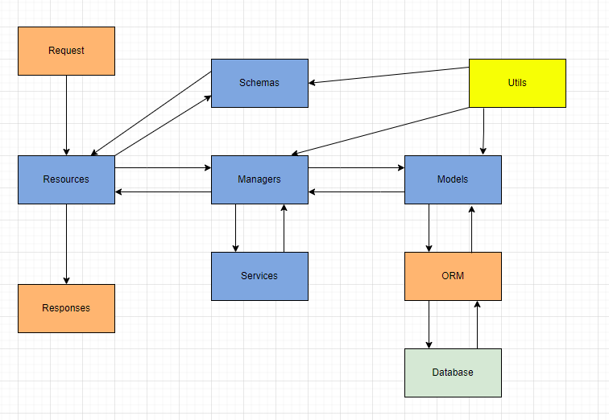

# FastAPI

## Working with Databases

```bash
docker run -d --name inavona -e POSTGRES_PASSWORD=mysecretpassword -e POSTGRES_USER=myusername -e PGDATA=/var/lib/postgresql/data/pgdata -p 5434:5432 -v C:\\Users\\super\\Documents\\databases\\inavona:/var/lib/postgresql/data -d postgres
```

Packages: 
* alembic
* sqlalchemy
* databases
* python-dotenv
* asyncpg
* psycopg2
* psycopg2-binary

## Database configuration

The basic and first step, but in the future we will work with migrations (Alembic)

```python
import databases
import sqlalchemy
from dotenv import dotenv_values

config = {
    **dotenv_values('.env')
}

DATABASE_URL = '%s://%s:%s@%s:%s/%s'%(
    config.get("DBDRIVER"),
    config.get("DBUSERNAME"),
    config.get("DBPASSWORD"),
    config.get("DBHOST"),
    config.get("DBPORT"),
    config.get("DBNAME")
)

data = databases.Database(DATABASE_URL)
metadata = sqlalchemy.MetaData()

books = sqlalchemy.Table(
    "books",
    metadata,
    sqlalchemy.Column("uuid", sqlalchemy.Uuid, primary_key=True),
    sqlalchemy.Column("title", sqlalchemy.String, nullable=False),
    sqlalchemy.Column("author", sqlalchemy.String, nullable=False),
)

engine = sqlalchemy.create_engine(DATABASE_URL)
metadata.create_all(engine)
```

## Alembic migration

We should change in *alembic.ini*  = sqlalchemy.url
We should change in *env.py* = target_metadata

```sh
alembic init migrations
alembic revision --autogenerate -m "Initial"
alembic upgrade head
alembic history
alembic downgrade 3b26579a015b
```

## Legacy code

```python

books = sqlalchemy.Table(
    "books",
    metadata,
    sqlalchemy.Column("uuid", sqlalchemy.Uuid, primary_key=True, unique=True),
    sqlalchemy.Column("title", sqlalchemy.String, nullable=False, unique=True),
    sqlalchemy.Column("author", sqlalchemy.String, nullable=False),
    sqlalchemy.Column("pages", sqlalchemy.Integer, nullable=False),
    sqlalchemy.Column("size", sqlalchemy.Enum(model_schemas.SizeEnum), nullable=False),
    sqlalchemy.Column("type_book", sqlalchemy.Enum(model_schemas.TypeBookEnum), nullable=False),
    sqlalchemy.Column(
        "created_at",
        sqlalchemy.DateTime,
        nullable=False,
        server_default=sqlalchemy.func.now(),
    ),
    sqlalchemy.Column(
        "updated_at",
        sqlalchemy.DateTime,
        nullable=False,
        server_default=sqlalchemy.func.now(),
        onupdate=sqlalchemy.func.now(),
    ),
    # sqlalchemy.Column("reader_uuid", sqlalchemy.ForeignKey("readers.uuid"), nullable=False, index=True),
)

readers = sqlalchemy.Table(
    "readers",
    metadata,
    sqlalchemy.Column("uuid", sqlalchemy.Uuid, primary_key=True, unique=True),
    sqlalchemy.Column("username", sqlalchemy.String, nullable=False, unique=True),
    sqlalchemy.Column("email", sqlalchemy.String, nullable=False, unique=True),
    sqlalchemy.Column("password", sqlalchemy.String, nullable=False),
    sqlalchemy.Column("reader_role", sqlalchemy.String, nullable=False),
    sqlalchemy.Column("disabled", sqlalchemy.Boolean, nullable=False, default=False),
    sqlalchemy.Column(
        "created_at",
        sqlalchemy.DateTime,
        nullable=False,
        server_default=sqlalchemy.func.now(),
    ),
    sqlalchemy.Column(
        "updated_at",
        sqlalchemy.DateTime,
        nullable=False,
        server_default=sqlalchemy.func.now(),
        onupdate=sqlalchemy.func.now(),
    ),
)

readers_books = sqlalchemy.Table(
    "readers_books",
    metadata,
    sqlalchemy.Column("uuid", sqlalchemy.Uuid, primary_key=True, unique=True),
    sqlalchemy.Column("book_id", sqlalchemy.ForeignKey("books.uuid"), nullable=False),
    sqlalchemy.Column(
        "reader_id", sqlalchemy.ForeignKey("readers.uuid"), nullable=False
    ),
)


async def get_valid_admin(token: Annotated[str, Depends(oauth2_scheme)]):
    credentials_exception = HTTPException(
        status_code=status.HTTP_401_UNAUTHORIZED,
        detail="Could not validate credentials",
        headers={"WWW-Authenticate": "Bearer"},
    )
    try:
        payload = jwt.decode(
            token, config.get("JWT_SECRET"), algorithms=[config.get("JWT_ALGORITHM")]
        )
        username: str = payload.get("sub")
        if username is None:
            raise credentials_exception
    except JWTError:
        raise credentials_exception

    user = await get_user(username)
    if user is None:
        raise credentials_exception
    return user


async def get_current_valid_admin(
    current_user: Annotated[model_schemas.UserSignIn, Depends(get_valid_admin)],
):
    if current_user["reader_role"] != "admin":
        raise HTTPException(status_code=400, detail="User does not have access")
    return current_user

@app.get("/books/", tags=["books"], status_code=200)
async def get_all_books(
    user: Annotated[None, Depends(get_current_active_user)],
    _: Annotated[None, Depends(get_current_valid_admin)],
):
    query = books.select()
    return await data.fetch_all(query)


@app.post("/books/", tags=["books"], status_code=201)
async def create_book(request: Request):
    uuid_value = uuid.uuid4()
    body = await request.json()

    query = readers.select().where(readers.c.username == body.get("username"))
    reader = await data.fetch_one(query)
    dict_reader = dict(reader)

    data_to_insert = {
        "uuid": uuid_value,
        "title": body.get("title"),
        "author": body.get("author"),
        "pages": body.get("pages"),
        "reader_uuid": dict_reader.get("uuid"),
    }
    query = books.insert().values(**data_to_insert)
    await data.execute(query)
    return {"book": uuid_value}


@app.get("/readers/", tags=["readers"])
async def get_all_readers():
    query = readers.select()
    return await data.fetch_all(query)


@app.post("/readers/", tags=["readers"])
async def create_reader(request: Request):
    uuid_value = uuid.uuid4()
    body = await request.json()
    body.update({"uuid": uuid_value})
    query = readers.insert().values(**body)
    await data.execute(query)
    return {"reader": uuid_value}


@app.post("/read/", tags=["read"], status_code=201)
async def create_read_relation(request: Request):
    uuid_value = uuid.uuid4()
    body = await request.json()
    # Get reader
    book_query = books.select().where(books.c.title == body.get("title"))
    book_data = await data.fetch_one(book_query)
    book_dict = dict(book_data)
    # Get book
    reader_query = readers.select().where(readers.c.username == body.get("username"))
    reader_data = await data.fetch_one(reader_query)
    reader_dict = dict(reader_data)

    data_to_insert = {
        "uuid": uuid_value,
        "book_id": book_dict.get("uuid"),
        "reader_id": reader_dict.get("uuid"),
    }
    query = readers_books.insert().values(**data_to_insert)
    await data.execute(query)
    return {"reader_book": uuid_value}


@app.post("/register/", tags=["register"], response_model=model_schemas.UserSignOut, status_code=201)
async def create_user(user: model_schemas.UserSignIn):
    user.password = get_password_hash(user.password)
    uuid_value = uuid.uuid4()
    data_to_insert = {"uuid": uuid_value, **user.model_dump()}
    query = users.insert().values(data_to_insert)
    await data.execute(query)
    return await data.fetch_one(users.select().where(users.c.uuid == uuid_value))
```

## Clean Code

Clean code is a set of rules and principles that helps to keep our code readable, maintainable, and extendable. 

* black: format your code, but exist another tools like flake8, autopep8 and yapf
* KISS: Keep it simple, stupid
* DRY: Do not repeat yourself
* SoC: Separation of Concerns
* SOLID:
    * Single responsibility
    * Open-closed
    * Liskov substitution 
    * Interface segregation
    * Dependency inversion

Invest in future!

